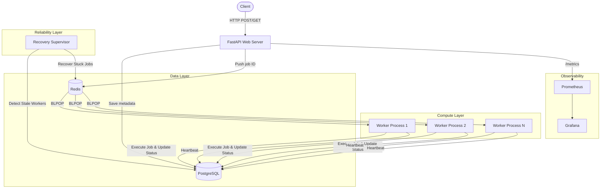

# TaskFlow Architecture

TaskFlow is designed as a distributed, fault-tolerant background job processing platform. The architecture separates the API, the job execution workers, and the reliability components.

## High-Level Diagram

## Component Roles

### 1. FastAPI Web Server
- **Role:** Handles incoming HTTP requests, validates payloads using Pydantic, applies rate limiting and JWT authentication.
- **Workflow:** When a job is submitted, it persists the job metadata in PostgreSQL with a `PENDING` status, and then enqueues the Job ID onto a Redis list based on the requested priority.

### 2. Data Layer
- **PostgreSQL:** The source of truth for the system. Stores users, jobs, job attempts, and worker registry statuses.
- **Redis:** Operates as an in-memory queue. It handles priority queues (High, Normal, Low), dead-letter queues, and delayed job retries (using sorted sets). Also stores rate-limiting counters.

### 3. Compute Layer (Workers)
Workers are stateless and horizontally scalable. Each worker process consists of:
- **Main Thread:** Blocks on Redis `BLPOP` to receive jobs. Upon receiving a job, it executes the relevant handler and updates the result in PostgreSQL.
- **Heartbeat Thread:** Continuously updates the worker's `last_heartbeat` timestamp in PostgreSQL to prove liveness.
- **Lease Renewal Thread:** Periodically extends a lease on the currently executing job to prove the job hasn't stalled.

### 4. Reliability Layer (Recovery Supervisor)
- Runs as a standalone process (or cron job).
- Sweeps the `workers` table for nodes whose heartbeats have expired, transitioning them to `SUSPECTED` and then `DEAD`.
- Sweeps the `jobs` table for jobs owned by `DEAD` workers where the lease has expired. It resets these jobs to `PENDING` and pushes them back to Redis for another worker to process.
- Employs PostgreSQL row-level locks (`SELECT FOR UPDATE SKIP LOCKED`) to ensure multiple supervisors do not conflict.

### 5. Observability
- The FastAPI application exposes a `/metrics` endpoint.
- Metrics are synchronized across multiprocess workers via Redis hashes and lists.
- Prometheus scrapes these metrics, and Grafana provides a visual dashboard for system health, queue depths, and processing latencies.
